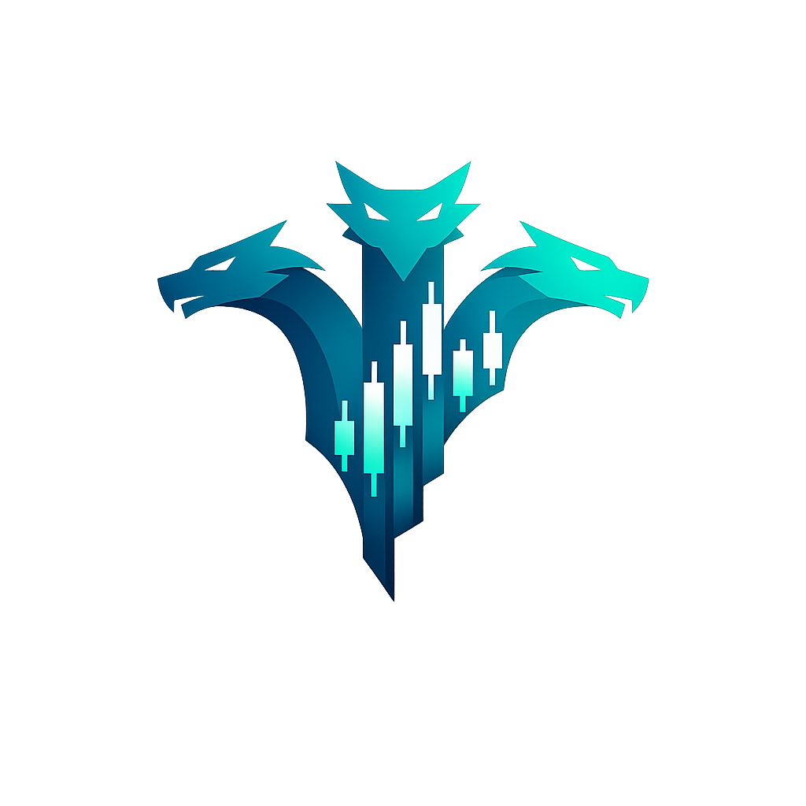

<p align="center">
  
</p>

<h1 align="center">HydraQuant</h1>

<p align="center">
  <strong>AI-Powered Quantitative Crypto Trading Engine</strong><br>
  <em>25 RAG Types &middot; 10 Autonomous Agents &middot; Evidence-First Signal Engine &middot; Self-Learning</em>
</p>

<p align="center">
  <a href="https://github.com/ymcbzrgn/HydraQuant/releases"></a>
  
  
  
  
  
  <a href="LICENSE"></a>
</p>

<p align="center">
  
  
  
  
  
</p>

---

> *"Cut one head, two more shall take its place."*
>
> Like the mythological Hydra, this system has no single point of failure. Kill an LLM provider, two fallbacks activate. Lose a data feed, three alternatives take over. Every component is redundant, self-healing, and self-learning.

---

## What is HydraQuant?

HydraQuant is an **AI-augmented quantitative trading engine** for cryptocurrency markets. It combines a massive RAG (Retrieval-Augmented Generation) system with an LLM-free Evidence Engine, multi-agent debate, and self-learning position sizing to generate, validate, and execute trading signals autonomously.

Built on top of [Freqtrade](https://github.com/freqtrade/freqtrade) (open-source crypto trading bot), HydraQuant extends it with **25,000+ lines of AI code**, transforming a rule-based bot into an adaptive intelligence system.

<p align="center">
  
</p>

### Philosophy

| Principle | Description |
|-----------|-------------|
| **Evidence-First** | The LLM-free Evidence Engine runs first. LLMs enhance, never dictate. |
| **Trade-First** | Default = TRADE, not BLOCK. Confidence modulates size, never permission. |
| **Self-Learning** | Bayesian Kelly sizing auto-shrinks after losses, auto-grows after wins. |
| **No Single Point of Failure** | 3-layer LLM failover, 3-layer macro data failover, graceful degradation at every level. |
| **Forgone P&L Tracking** | Tracks what you *didn't* trade. If guardrails destroy more value than they protect, they auto-loosen. |

---

## Architecture Overview

```
                    +-------------------------+
                    |    REST API (27 eps)    |
                    |    Telegram Bot Control  |
                    +------------+------------+
                                 |
              +------------------+------------------+
              |                                     |
    +---------+---------+              +------------+------------+
    |  Evidence Engine   |              |    RAG Pipeline (18)    |
    |  (LLM-FREE)        |              |    + MADAM Debate       |
    |  6 sub-scores       |              |    + 10 Agent Pool      |
    |  Dynamic-k sigmoid  |              |    + Cross-Pair Intel   |
    +---------+---------+              +------------+------------+
              |                                     |
              +------------------+------------------+
                                 |
                    +------------+------------+
                    |   Decision Synthesis    |
                    |   Confidence Calibrator |
                    |   Contradiction Detect  |
                    +------------+------------+
                                 |
              +------------------+------------------+
              |                                     |
    +---------+---------+              +------------+------------+
    |  Position Sizing   |              |   Risk Management       |
    |  BayesianKelly     |              |   Dynamic VaR Budget    |
    |  ATR-based SL      |              |   Graduated Autonomy    |
    +---------+---------+              +------------+------------+
              |                                     |
              +------------------+------------------+
                                 |
                    +------------+------------+
                    |      Exchange API       |
                    |   Bybit / Binance /...  |
                    +-------------------------+
```

---

## The Hydra's Heads

### Head 1: Evidence Engine (LLM-Free)

The core signal generator. **Zero API cost, ~50ms latency.** Decomposes every trading decision into 6 independent sub-questions:

| Sub-Score | Weight | What it Measures |
|-----------|--------|-----------------|
| **Trend** | 0.22 | EMA cascade alignment + ADX strength |
| **Momentum** | 0.20 | RSI >50 momentum zone (2.8x alpha vs oversold) |
| **Crowd** | 0.22 | F&G extremes + funding rate + L/S ratio (contrarian) |
| **Evidence** | 0.15 | k-NN historical matching + backtest pattern stats |
| **Macro** | 0.10 | DXY, VIX, S&P500, Gold (low crypto correlation) |
| **Risk** | 0.11 | ATR volatility + volume confirmation |

**Adaptive Synthesis:** Blind sub-scores (no data) are automatically excluded and their weights redistributed. Dynamic-k sigmoid adjusts confidence sharpness based on factor alignment — disagreement makes the engine *cautious*, not *blind*.

### Head 2: RAG Pipeline (25 Types)

The largest RAG implementation in any open-source trading system:

<p align="center">
  
</p>

| Category | RAG Types |
|----------|-----------|
| **Core Retrieval** | Hybrid (Dense+BM25+ColBERT+RRF), Semantic Cache, Binary Quantization |
| **Quality Control** | CRAG (Corrective), Self-RAG (Reflective), FLARE (Forward-Looking), RAGAS Feedback Loop |
| **Reasoning** | CoT-RAG (Chain-of-Thought), Speculative RAG, HyDE, RAG-Fusion |
| **Memory** | MemoRAG (Global), StreamingRAG (Hot/Cold), Bidirectional (Lessons), MAGMA (Graph) |
| **Structure** | RAPTOR (Hierarchical), GAM-RAG (Graph-Augmented), GraphRAG (Community), Adaptive Router |
| **Context** | Contextual Retrieval (Anthropic-style), Regime-Aware Filter, Event-Driven Temporal |
| **Self-Improving** | Outcome-Based Chunk Scoring (PnL→quality), Agentic RAG (agent-driven retrieval) |
| **Reranking** | ColBERT v2 (Token-level), FlashRank (Lightweight) |

### Head 3: Agent Pool (10 Specialists)

Inspired by MiroFish's $30M autonomous trading system. Each agent has a personality, memory, and track record:

| Agent | Role | Best Regime |
|-------|------|-------------|
| TrendFollower | EMA + ADX momentum signals | Trending markets |
| MeanReverter | RSI extreme + BB contrarian | Ranging markets |
| MomentumRider | Accelerating moves + volume | Bull runs |
| FundingContrarian | Fade extreme funding rates | High volatility |
| RiskMinimizer | Capital preservation, drawdown limits | Uncertain markets |
| DevilsAdvocate | Challenge the majority (always active) | All regimes |
| EvidenceValidator | Fact-check agent claims against data | All regimes |
| MacroCorrelator | DXY-BTC, S&P500, Treasury cross-asset | All regimes |
| TemporalAnalyst | Day/hour seasonality, FOMC/CPI events | Transitions |
| ReflectionAgent | Meta-analysis of agent past performance | All regimes |

**Debate Protocol:** 5 agents selected per signal (2 permanent + 3 regime-based). 3-round debate: Position, Cross-Examination, Meta-Analysis.

### Head 4: Self-Learning Risk Engine

| Component | What it Does |
|-----------|-------------|
| **Bayesian Kelly** | Self-learning position sizing. Losses auto-shrink bets, wins auto-grow. |
| **Dynamic VaR** | Millennium/Citadel pod-model risk budgeting. Daily reset, per-trade limits. |
| **Graduated Autonomy** | 6 levels (L0 Backtest → L5 Full Auto). Trust earned via Beta distribution. |
| **Forgone P&L** | Tracks shadow trades (signals not executed). Proves if thresholds are too tight. |
| **Confidence Calibrator** | Platt scaling: "When AI says 80% confident, is it *really* 80%?" |

### Head 5: Data Pipeline (8 Sources, $0/month)

| Source | Data | Cost |
|--------|------|------|
| Bybit Public API | Open Interest, Funding Rate, L/S Ratio | Free |
| DeFi Llama | TVL, Stablecoin Supply | Free |
| CoinGecko | BTC Dominance, Total Market Cap | Free |
| Yahoo Finance (HTTP) | DXY, VIX, S&P500, Gold, NASDAQ | Free |
| FRED (Federal Reserve) | DXY, Treasury Yields, VIX (fallback) | Free (key) |
| RSS (15 feeds) | CoinDesk, CoinTelegraph, Decrypt, The Block... | Free |
| Google Trends | "buy bitcoin", "crypto crash" search interest | Free |
| CryptoCurrency.cv | 200+ sources, built-in sentiment, SSE stream | Free |

**3-layer macro fallback:** yfinance → Yahoo HTTP → FRED. If all 3 fail, Evidence Engine gracefully degrades.

---

## By the Numbers

| Metric | Value |
|--------|-------|
| AI Python modules | **66** |
| Lines of AI code | **26,000+** |
| RAG types implemented | **25** (self-improving) |
| Autonomous agents | **10** |
| Evidence Engine sub-scores | **6** |
| IStrategy callbacks | **19** |
| Scheduled jobs | **27** |
| API endpoints | **27** |
| SQLite tables | **36** |
| Tests | **189** |
| Data sources | **8** (all free) |
| LLM providers (failover) | **3** (Gemini → Groq → OpenRouter) |
| Web UI (FreqUI) | **Vue 3 + PrimeVue** |
| AI/ML dependencies | **28** |

---

## Quick Start

### Prerequisites

- Python 3.11+
- 4GB+ RAM (8GB recommended for model server)
- API keys: Gemini (primary), Groq (optional), OpenRouter (optional)

### Installation

```bash
# Clone
git clone https://github.com/ymcbzrgn/HydraQuant.git hydraquant
cd hydraquant

# Setup
python -m venv .venv && source .venv/bin/activate
pip install -e . && pip install -r requirements-ai.txt

# Download embedding models (BGE + ColBERT + FlashRank)
python user_data/scripts/download_models.py

# Configure
cp config_examples/config_bybit_testnet_futures.json config.json
# Edit config.json with your exchange API keys

# Environment
cat > .env << EOF
GEMINI_API_KEY=your_key_here
GROQ_API_KEY=your_key_here        # optional
OPENROUTER_API_KEY=your_key_here  # optional
EOF

# Bootstrap data (patterns, embeddings, MAGMA graph)
PYTHONPATH=user_data/scripts python user_data/scripts/bootstrap_data.py --all
```

### Running

```bash
# Start all 4 services
python user_data/scripts/model_server.py &     # Port 8895: BGE + ColBERT + FlashRank
python user_data/scripts/scheduler.py &         # 22 background jobs
python user_data/scripts/api_ai.py &            # Port 8891: AI REST API
freqtrade trade --strategy AIFreqtradeSizer --config config.json
```

### Docker

```bash
docker build -f docker/Dockerfile.ai -t hydraquant .
docker-compose up -d
```

---

## Signal Flow

```
Market Data (1h candles)
    |
    v
+-------------------+     +-------------------+
| Evidence Engine    |     | RAG Pipeline      |
| (LLM-free, 50ms)  |     | (18 RAG types)    |
| 6 sub-scores       |     | + MADAM Debate    |
+--------+----------+     +--------+----------+
         |                          |
         v                          v
    +---------+              +-----------+
    | BULLISH |              |  BULLISH  |
    | conf=0.68|              |  conf=0.72|
    +---------+              +-----------+
         |                          |
         +------------+-------------+
                      |
                      v
            +-------------------+
            | Agent Pool Vote   |
            | (5 agents, 3 rnd) |
            +--------+----------+
                     |
                     v
            +-------------------+
            | Cross-Pair Intel  |
            | (BTC lead, crowd) |
            +--------+----------+
                     |
                     v
            +-------------------+
            | Confidence Calib  |
            | Platt scaling     |
            +--------+----------+
                     |
                     v
        +-----------+-----------+
        |                       |
   conf >= 0.40            conf < 0.40
        |                       |
   REAL TRADE              SHADOW TRADE
   BayesianKelly           (paper only,
   position size            for learning)
        |
        v
   +----------+
   | Exchange  |
   | Bybit API |
   +----------+
```

---

## Disclaimer

This software is for **educational and research purposes only**. Cryptocurrency trading carries significant risk. Do not trade with money you cannot afford to lose. The authors assume no responsibility for trading losses.

**Always start with testnet.** This system is designed for Bybit/Binance testnet first, with graduated autonomy (L0→L5) before any real capital deployment.

---

## Attribution

HydraQuant is built on top of [Freqtrade](https://github.com/freqtrade/freqtrade), an open-source crypto trading bot licensed under GPL v3. We gratefully acknowledge the Freqtrade team's foundational work.

**Modifications from original Freqtrade:**
- Added 64 AI modules (25,032 lines) for RAG, Evidence Engine, Agent Pool, and autonomous trading
- Extended IStrategy with 19 AI-powered callbacks
- Added 4 microservices (model server, scheduler, AI API, RAG pipeline)
- FreqUI web dashboard with AI-specific components
- Telegram bot integration for daily/weekly AI summaries and trade alerts
- All original Freqtrade functionality is preserved and fully operational

## License

This project is licensed under the [GNU General Public License v3.0](LICENSE) — the same license as Freqtrade.

You are free to use, modify, and distribute this software under the terms of GPL v3. Modified versions must be marked as changed and distributed under the same license.

---

<p align="center">
  
  <br>
  <strong>HydraQuant</strong> &mdash; Cut one head, two more shall take its place.
  <br>
  <sub>Built with Freqtrade | Powered by Evidence</sub>
</p>
