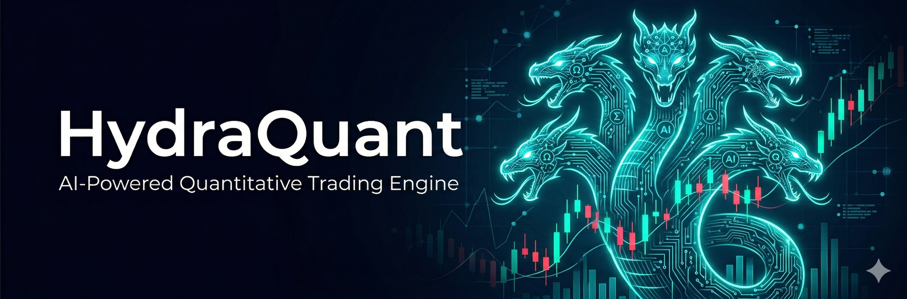
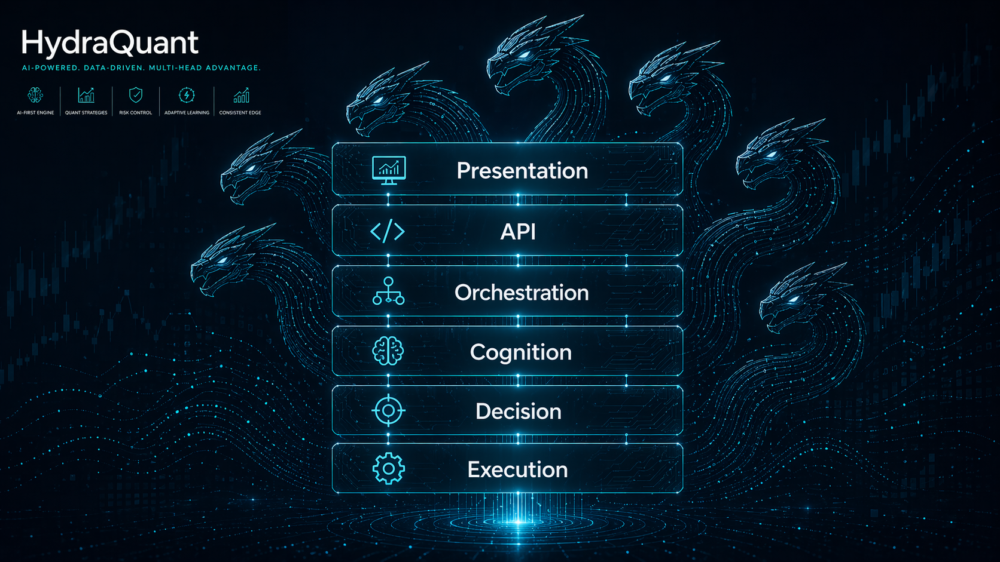
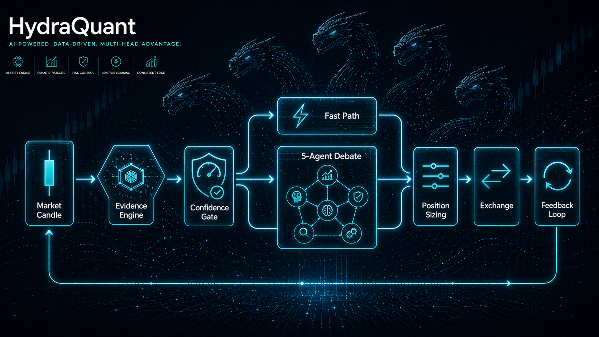
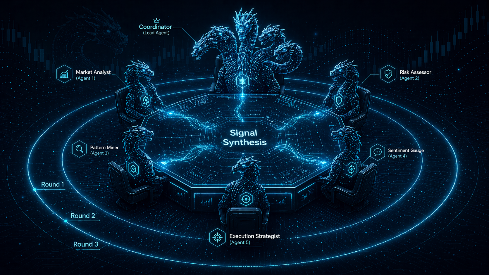
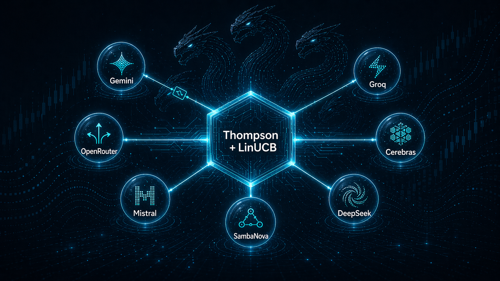
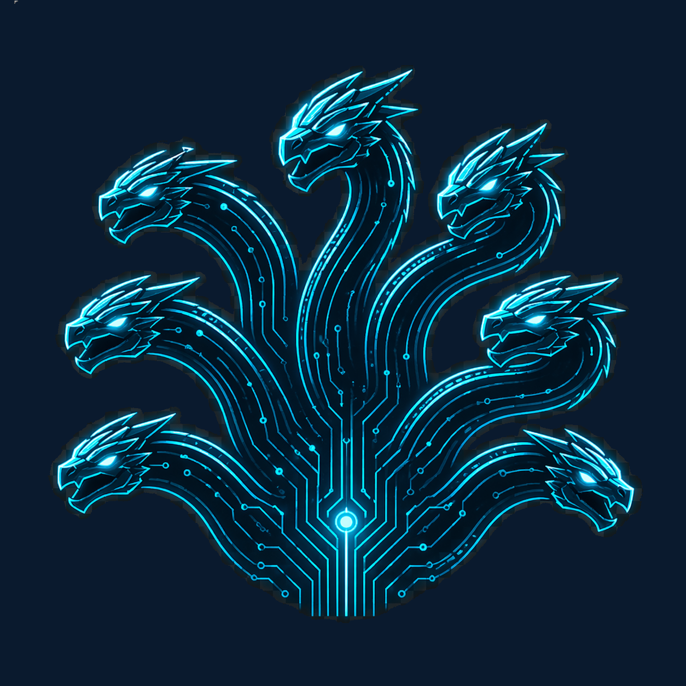

<p align="center">
  
</p>

<h1 align="center">HydraQuant</h1>

<p align="center">
  A cognitive trading organism for cryptocurrency markets.
</p>

<p align="center">
  <a href="LICENSE"></a>
  
  
</p>

---

## Overview

HydraQuant trades crypto the way a brain does: by remembering, debating, and learning from every signal it sees. Under the hood it combines a rule-based signal engine, a multi-agent LLM debate, brain-inspired adaptive learning, and Bayesian position sizing into a single closed loop. It is built on top of the [freqtrade](https://github.com/freqtrade/freqtrade) execution framework, which handles exchange integration, candle streaming, and order persistence.

Unlike classical ML trading pipelines that retrain on a schedule and forget between runs, HydraQuant learns continuously. Every closed trade mutates an adaptive parameter organism: learning rates, risk thresholds, exit multipliers, and agent-selection weights all evolve based on outcomes.

The system runs entirely on free-tier LLM providers and free data sources. It is designed for Bybit and Binance testnet first, with a graduated autonomy ladder that scales position sizing only after sustained performance.

## Why HydraQuant

- **LLMs earn their turn.** The rule-based Evidence Engine runs first in ~50 ms at zero API cost; large language models are invoked only when remaining uncertainty justifies them. Most trading decisions never touch an LLM.
- **The organism never calcifies.** Every closed trade mutates a parameter-neuron substrate via BCM metaplasticity and STDP temporal credit. Parameters that change frequently become resistant to further change; parameters that change just before a trade receive more credit or blame. Learning continues indefinitely without drift.
- **Modules don't message — they deposit.** A stigmergic pheromone field replaces locks and queues with leaky-integrate dynamics. Subsystems deposit signals; readers see a continuously decaying summary. No RLock, no cascading waits, no race conditions.
- **Confidence sizes; it never blocks.** A 0.40 signal becomes a shadow trade the calibrator studies forever. A 0.75 signal becomes a standard position. A 0.95 signal in a favorable regime, with the organism's cortisol low and the immune system quiet, becomes a larger one. The default is TRADE.
- **Forgotten decisions are tracked.** A forgone-alpha ledger records every skipped signal and what it would have earned. When caution costs alpha over a sustained window, the per-pair confidence thresholds auto-loosen. The system studies its own hesitation.
- **No single point of failure.** Seven LLM providers behind a Thompson + LinUCB bandit router with circuit breaker. Three macro-data cascades. Four memory substrates each addressing a distinct access pattern. Five independent risk guardrails. Cut any head — the rest keep thinking.

<p align="center">
  
</p>

## Architecture

HydraQuant is organized in six layers:

- **Presentation** — a Vue 3 web dashboard (FreqUI extended with HydraQuant views and widgets) and an outbound Telegram notifier.
- **API** — a FastAPI read surface on port 8890 exposing system state (signals, risk, organism, cost, evidence) through documented GET endpoints.
- **Orchestration** — an in-process APScheduler driving periodic jobs: training, evolution, causal discovery, sleep consolidation, cost summaries.
- **Cognition** — the Evidence Engine, MADAM multi-agent debate, AgentPool, LLM Router, Neural Organism, and pheromone field.
- **Decision** — Bayesian Kelly sizing, Constitution enforcement, risk budget, graduated autonomy, Chandelier exits.
- **Execution** — delegated to freqtrade: CCXT-based exchange integration, candle streaming, order lifecycle, persistence.

## How It Works

<p align="center">
  
</p>

A trading decision flows through the following stages:

1. **Candle arrival.** Freqtrade invokes the strategy's `populate_entry_trend` callback.
2. **Triple Perception.** Three complementary forecasters run in parallel: Tiny Time Mixer embeddings, Chronos-Bolt probabilistic quantiles, and a CatBoost classifier trained on engineered chart features. Their outputs are fused into a direction estimate, a magnitude estimate, and an uncertainty-aware sizing multiplier.
3. **Evidence Engine.** A rule-based signal generator scores the trade across six independent sub-questions — trend, momentum, crowd positioning, historical evidence, macro, risk — using data from Bybit's public API, DeFi Llama, CoinGecko, Yahoo Finance, FRED, RSS feeds, Google Trends, and cryptocurrency.cv. Weights adapt to the current market regime. The engine completes in under 50ms with no LLM cost.
4. **Confidence gate.** If Evidence Engine confidence exceeds an organism-adaptive threshold, the signal ships immediately and a background MADAM debate populates the semantic cache for the next cycle. Otherwise the slow path is taken.
5. **MADAM debate.** Four to seven specialist agents are selected from a registry of twelve based on the current regime. They run a three-round debate: parallel analysis, conditional cross-examination (skipped when round-one consensus is high enough), and meta-synthesis.
6. **Position sizing.** A nine-stage pipeline applies Bayesian Kelly per pair per regime, Peters volatility drag, Baker-McHale small-sample shrinkage, trade-graduation scaling, effective-number-of-bets diversification, and blended multipliers from CAAT, DualAxis, cerebellum timing, and lifecycle.
7. **Risk guards.** Constitution (hard caps), VaR budget, pair-specific immune memory, equal-risk cap, and minimum-stake guard cascade before the order reaches the exchange.
8. **Organism update.** On trade close, a sixteen-step cycle updates the Neural Organism: BCM metaplasticity, STDP temporal credit, amygdala fear learning, hippocampal memory write, prediction-error learning-rate boost, pheromone deposits, immune memory, prefrontal executive veto.

## Evidence Engine

<p align="center">
  
</p>

The Evidence Engine is the core signal generator. It is rule-based and LLM-free, which makes it fast and deterministic.

It decomposes every trading decision into six sub-questions:

- **Trend** — is price aligned with medium-term EMA cascade and supported by ADX strength?
- **Momentum** — is there persistent follow-through, measured through RSI position and MACD agreement?
- **Crowd positioning** — where is the crowd, via Fear & Greed, funding rate, and long/short ratio? Interpreted contrarian.
- **Historical evidence** — do nearest neighbors in the pattern database and backtest statistics support the direction?
- **Macro** — what are DXY, VIX, Treasury yields, and BTC dominance doing?
- **Risk** — is volatility (ATR) and volume supporting a reliable trade?

Each sub-question is scored independently, weights are regime-adaptive, and disagreement between sub-scores makes the final synthesis cautious rather than neutral. Sub-questions with missing data abstain explicitly; their weight is redistributed across the remaining sub-questions rather than defaulting to a neutral value that would pollute downstream statistics.

## MADAM Debate

<p align="center">
  
</p>

When Evidence Engine confidence is insufficient, HydraQuant convenes a multi-agent debate.

Twelve specialist agents are registered: `TrendFollower`, `MeanReverter`, `MomentumRider`, `FundingContrarian`, `RiskMinimizer`, `DevilsAdvocate`, `EvidenceValidator`, `MacroCorrelator`, `TemporalAnalyst`, `ExploiterAgent`, `DefenderAgent`, `ReflectionAgent`. Four to seven are selected per debate based on the current market regime (trending bull, trending bear, ranging, high-volatility, transitional).

The debate runs in three rounds:

- **Round 1** — parallel analysis. Each agent forms an independent position with a 12-second wall-clock budget.
- **Round 2** — cross-examination, skipped when Round 1 consensus is already high enough to save LLM cost.
- **Round 3** — meta-synthesis by a coordinator that considers argument quality, agent track record, and consistency with the Evidence Engine output.

Every debate is persisted: agent arguments go to the `agent_memory` table, quality scores go to `argument_quality`, and the full causal structure is written to the Grafeo graph. The argument-quality scores feed back into agent selection via a RLAIF loop.

## Neural Organism

<p align="center">
  
</p>

Parameters that would be hardcoded constants in a traditional system — learning rates, risk thresholds, exit multipliers, weight coefficients — are represented in HydraQuant as neurons. Each neuron holds a Beta posterior, is sampled via Thompson draw when its value is needed, and is updated via BCM metaplasticity and STDP temporal credit when outcomes arrive.

Around these neurons the organism has seventeen biologically-inspired subsystems:

- **Hormones** — cortisol, dopamine, serotonin, adrenaline — modulate the whole system. Cortisol decays with a 24-hour half-life from its peak, so yesterday's drawdown still affects today's risk appetite.
- **Amygdala** — graduated fear response with four tiers and explicit decay.
- **Hippocampus** — stores situation fingerprints and their outcomes; provides recall for the prefrontal cortex.
- **Prefrontal Cortex** — executive veto with five hard rules that do not learn (leverage cap, equity-loss bound, confidence cap on low information quality, adrenaline freeze, hippocampal warning).
- **Basal Ganglia** — habit consolidation. Neurons that have updated frequently and converged become resistant to change.
- **Cerebellum** — 24-slot hour-of-day timing model.
- **Mirror Neurons** — crowd behavior inference from funding, long/short ratio, and open interest.
- **Adaptive Immunity** — B-cell-style per-pattern memory. Known threat patterns auto-reduce sizing.
- **Predictive Model** — free-energy-principle prediction error boosts learning rate on surprise.
- **Interoception** — eight internal sensors (drift, belief width, hormone stability, data completeness, etc.) producing an organism health score.
- **Default Mode Network** — idle counterfactual analysis on worst recent episodes.
- **Sleep Consolidation** — weekly synapse decay and stale habit breaking.
- **Neuroevolution** — tournament selection over archived genomes, blending toward the best when performance degrades.
- **Proprioception** — lifecycle-phase awareness (learning / maturing / mature / overconfident) that modulates learning rate.

Coordination between modules is **stigmergic**. Instead of passing messages through locks, modules deposit signals into a shared pheromone field with leaky-integrate dynamics. Every reader sees a continuously decaying summary of recent activity, and no one blocks anyone.

## LLM Router

<p align="center">
  
</p>

HydraQuant runs entirely on free-tier LLM providers. Seven providers are supported — **Gemini**, **Groq**, **Cerebras**, **DeepSeek**, **SambaNova**, **Mistral**, and **OpenRouter** — with model slot expansion over multiple API keys.

The router uses Thompson sampling for exploration (a Beta posterior over success rate per slot) and a LinUCB contextual bandit for exploitation once a slot has accumulated enough samples. The context vector captures task type, prompt length, JSON requirement, market regime, and hour of day.

A circuit breaker on the Gemini path prevents cascade failures: ten failures within a sixty-second window opens the breaker for thirty seconds, and three consecutive successes close it again.

When a trade closes, the router walks back through every LLM call that fired during the trade's lifetime and applies a small retroactive reward to each contributing slot's LinUCB posterior. This closes the loop between LLM quality and realized PnL.

## Risk Engine

Position sizing uses a **nine-stage pipeline**: Beta posterior, Peters volatility drag, volatility-of-volatility shrinkage, Baker-McHale small-sample correction, trade-graduation scaling, effective-number-of-bets diversification, blended multiplier from CAAT / DualAxis / cerebellum / lifecycle, Constitution clamp, equal-risk cap, minimum-stake guard.

Graduated autonomy runs from L0 (nano-live trading at 3% Kelly fraction) up to L5 (75% Kelly fraction). Promotion requires sustained trade count, Sharpe ratio, maximum drawdown bound, and minimum time at each level.

A **shadow Kelly ledger** runs in parallel with the real ledger. Every decision that was considered but not executed — through confidence shortfall, minimum-stake guard, or Constitution block — is recorded. The shadow ledger calibrates thresholds (the **Forgone Alpha Harvester** auto-loosens per-pair thresholds when the foregone PnL is consistently positive) without contaminating live sizing.

Exits are **confidence-adaptive Chandelier** ATR trailing stops. High-confidence signals use tighter multipliers, low-confidence signals use wider ones. Hurst exponent scales the multiplier further in strongly trending markets. The Constitution enforces hard stops on drawdown, leverage, position concentration, and consecutive-loss streaks.

## Installation

```bash
git clone https://github.com/ymcbzrgn/HydraQuant.git hydraquant
cd hydraquant

python -m venv .venv
source .venv/bin/activate

pip install -e .
pip install -r requirements/requirements-phase27.txt

python user_data/scripts/download_models.py
```

## Configuration

Copy an example config and edit with your exchange and LLM API keys:

```bash
cp config_bybit_testnet_futures.json config.json
# Edit config.json with your API keys and pair whitelist
```

Environment variables live in `.env`:

```
GEMINI_API_KEY_1=...
GROQ_API_KEY=...
CEREBRAS_API_KEY=...
TELEGRAM_BOT_TOKEN=...
TELEGRAM_CHAT_ID=...
BYBIT_API_KEY=...
BYBIT_SECRET=...
```

## Running

HydraQuant runs as five processes:

```bash
python user_data/scripts/model_server.py &      # embedding and reranker models
python user_data/scripts/rag_graph.py &         # RAG orchestrator and MADAM
python user_data/scripts/api_ai.py &            # FastAPI read surface
python user_data/scripts/scheduler.py &         # periodic jobs

freqtrade trade --strategy HydraSizer --config config.json
```

Or using Docker Compose:

```bash
docker compose -f docker/docker-compose.ai.yml up -d
```

On a systemd-managed host, install the provided unit:

```bash
sudo cp docker/hydraquant.service.watchdog /etc/systemd/system/hydraquant.service
sudo systemctl daemon-reload
sudo systemctl enable --now hydraquant
```

## Project Structure

```
user_data/scripts/       HydraQuant AI modules (Evidence Engine, MADAM, Organism, ...)
user_data/strategies/    HydraSizer strategy — the bridge to freqtrade
user_data/db/            SQLite (ai_data), LanceDB vector store, Grafeo graph store
tests/                   Test suite
docs/                    Architecture, design, and phase documents
frequi/                  Vue 3 web dashboard (FreqUI fork with HydraQuant views)
docker/                  Dockerfile.ai, docker-compose.ai.yml, systemd units
freqtrade/               Vendored freqtrade execution framework (GPL v3)
```

## Documentation

| Document | Scope |
|---|---|
| [Architecture](docs/ARCHITECTURE.md) | Full technical architecture and signal flow |
| [Neural Organism](docs/NEURAL_ORGANISM.md) | Brain subsystems, BCM, STDP, hormones |
| [Evidence Engine](docs/EVIDENCE_ENGINE.md) | Six sub-questions, regime weights, synthesis |
| [LLM Routing](docs/LLM_ROUTING.md) | Thompson sampling, LinUCB, circuit breaker |
| [Features](docs/FEATURES.md) | Full feature catalog with status markers |
| [Deployment](docs/DEPLOYMENT.md) | Production setup, systemd, health dashboard |
| [Roadmap](docs/ROADMAP.md) | Phase 29 current sprint and forward plan |
| [Changelog](docs/CHANGELOG.md) | Phase-by-phase release history |

## Testing

```bash
PYTHONPATH=user_data/scripts python -m pytest tests/test_ai_scripts.py -v
```

A dedicated health-check script verifies system state after deploys:

```bash
python user_data/scripts/deploy_health_check.py
```

## Where We Are

HydraQuant is in **testnet alpha**, actively shipping Phase 30. The current PnL on live testnet is not yet positive — which is the reason Phase 30 exists. The fixes under way:

- Backtest framework revival — so every change can be measured instead of hoped.
- Funding-rate and open-interest divergence as a seventh Evidence Engine sub-score.
- Regime-aware dynamic Chandelier exits to repair payoff-ratio asymmetry.
- Conditional drawdown-at-risk circuit breaker to stop death-by-thousand-cuts.
- MADAM sampling + voting to correct the martingale bias of naïve debate averaging.

The graduated autonomy ladder (L0 → L5) is designed for exactly this stage. L0 trades at a 3% Kelly fraction while the organism learns its priors. Each promotion is gated on sustained Sharpe, maximum-drawdown bounds, and minimum time at level. No shortcut exists.

This is a research platform with live trading loops — not a finished product. Everything is open source, every phase is documented, every metric is honest. The public roadmap lives in [docs/ROADMAP.md](docs/ROADMAP.md); what has shipped lives in [docs/CHANGELOG.md](docs/CHANGELOG.md).

## Contributing

See [CONTRIBUTING.md](CONTRIBUTING.md) for development setup, testing requirements, and code style.

## License

HydraQuant is licensed under the GNU General Public License v3.0. This matches the license of the underlying freqtrade execution framework.

## Acknowledgments

HydraQuant delegates exchange integration, order management, and candle streaming to [freqtrade](https://github.com/freqtrade/freqtrade) (GPL v3). Everything above that layer — the cognitive pipeline, the organism, the routing, the sizing, the risk engine — is HydraQuant's own work.

<p align="center">
  
</p>
